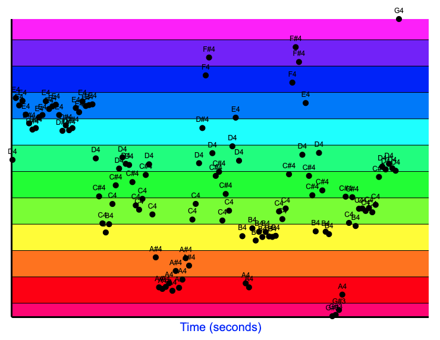
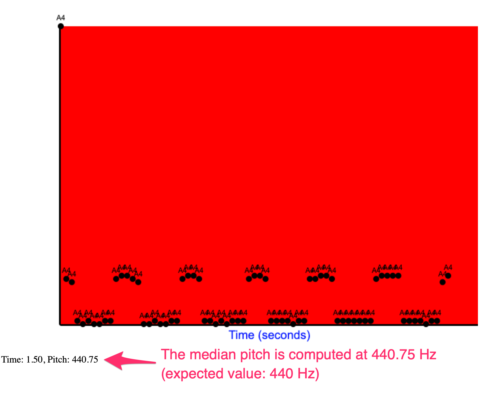

## Fundamental Frequency Finder 


Demo URL: [https://fundfrequency.kiok.org/](https://fundfrequency.kiok.org/)

This project's goal is to find the fundamental frequencies of a given audio file, which is the lowest pitch detected. Autocorrelation is the primary function used, but other options may be added in the future for comparison and contrast. The frequencies of each timestamp are then plotted on a logarithmic graph, which also displays the estimated note values at each given time. There are three given examples, but users can also upload their own MP3s. 

Note that fundamental frequency detection is still largely an open problem, and may perform suboptimally with polyphony (multiple notes being played at once) or audio noise.

The program is written in Python and uses Librosa for audio processing and Statsmodels for autocorrelation. It auto-deploys to DockerHub and Render. The website (as well as generated graphs) may take a minute to load at first, as the CPU is not very powerful, but subsequent requests should be much faster.

### Usage 

```
$ pip install -r requirements.txt
$ python3 app.py
```

### Screenshots

#### Fur Elise



#### A4 Tuning Fork (440 Hz)

